# U-Net neural network for restoring blurred images

## 1. Dataset
### The model was trained on the [CelebFaces Attributes (CelebA) Dataset](https://www.kaggle.com/datasets/jessicali9530/celeba-dataset)
### Examples:
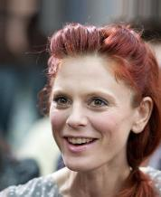 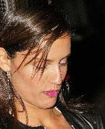 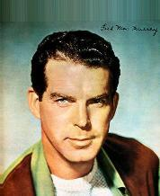

## 2. Data preprocessing
### Script for data preprocessing: `dataset_preparing.py`
### Input:


### Output:
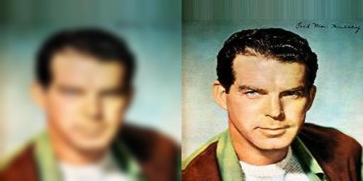

## 3. Training model
### Loss Graphic:
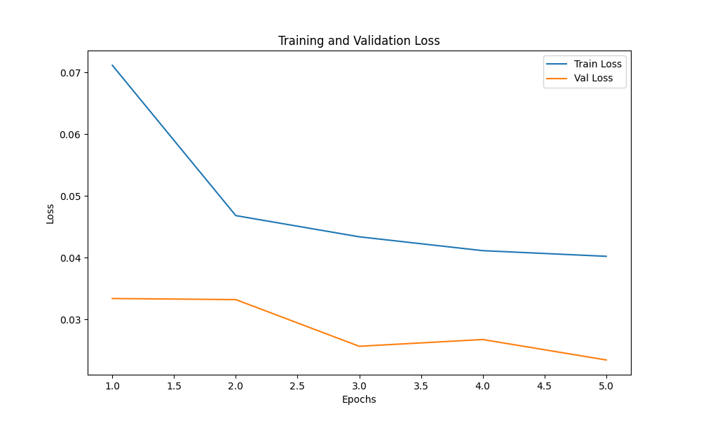

## 4. Testing model(dataset images)
### Results:
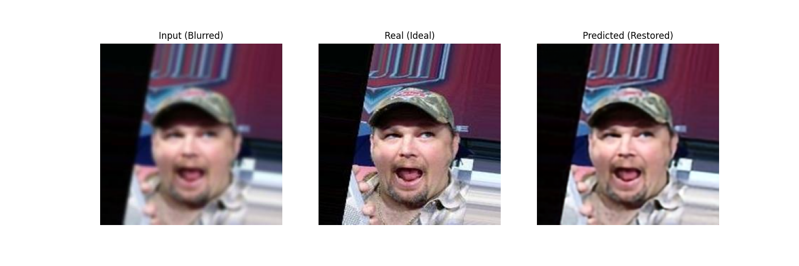
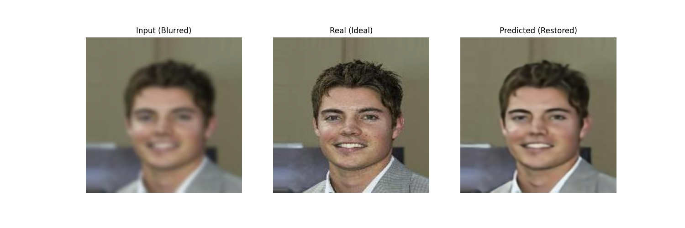
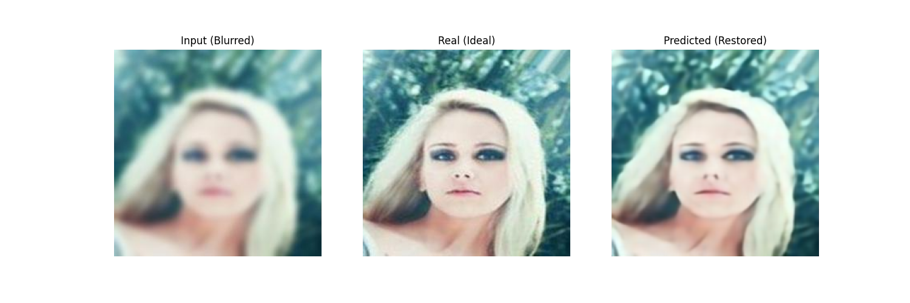
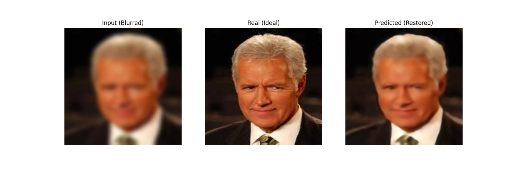
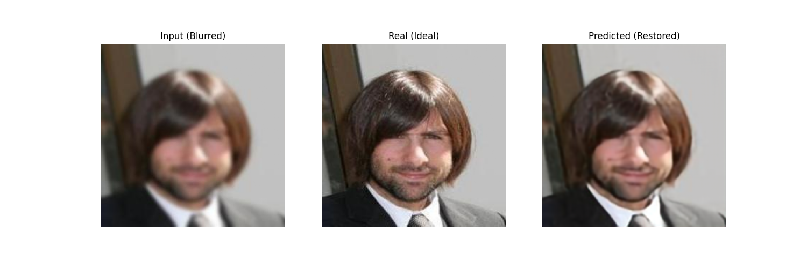
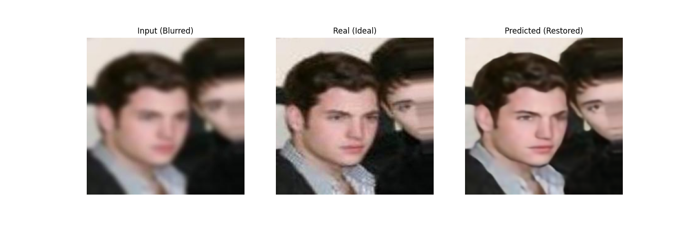
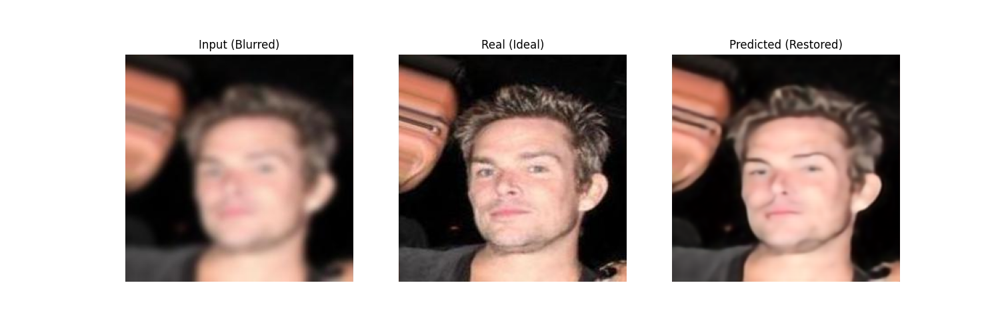
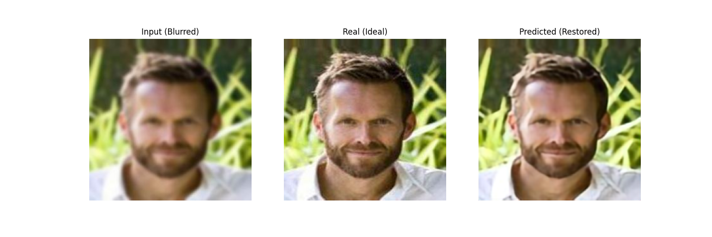
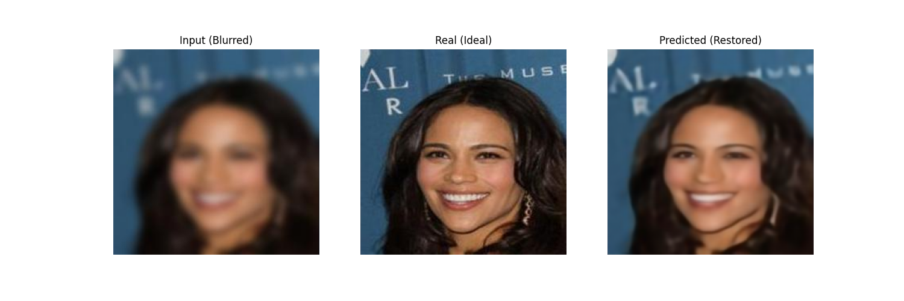
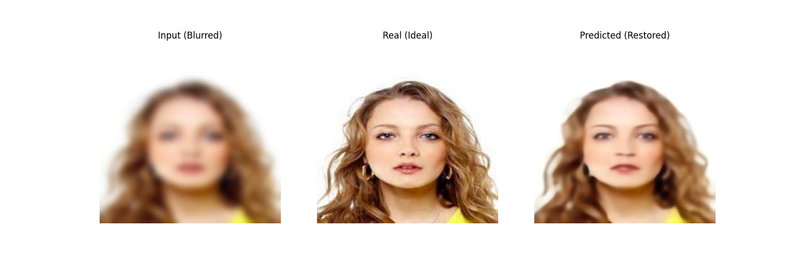

## 5. Testing model(NOT dataset images)
### Script for testing on new image: `test_unet.py`
### Results:

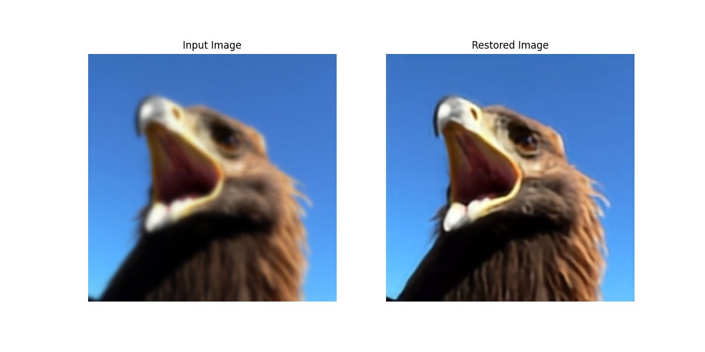

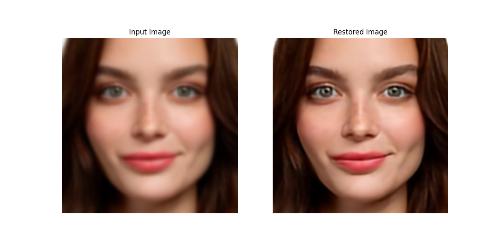

ㅤ
### Trained model: `unet_model.pth`
#### How to load:
```
model = UNet().to(device).eval()
model.load_state_dict(torch.load('unet_model.pth', map_location=device, weights_only=True))
```

ㅤ
## 6. Model integration into telegram bot
### Scripts for creating a telegram bot: `tg_bot.py`,`image_recovery.py`

### Example ot using:
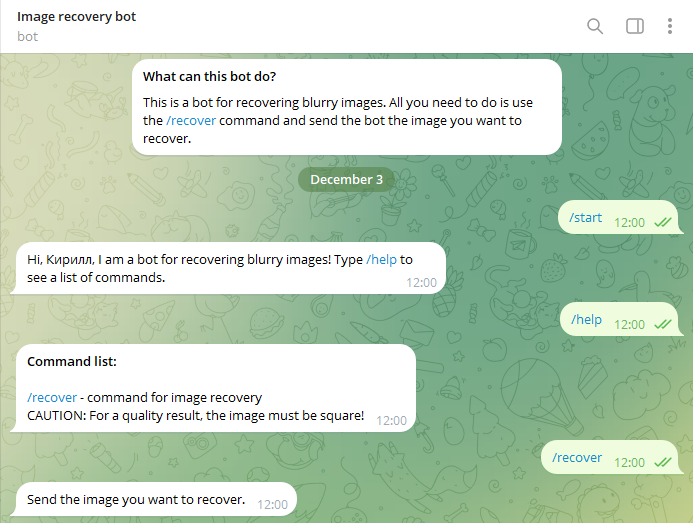
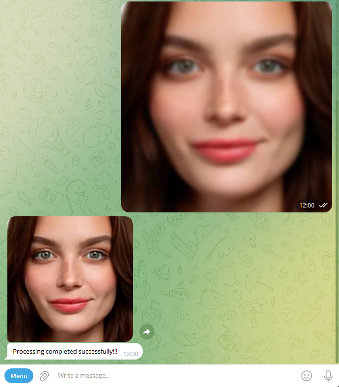

#### [Bot](https://t.me/ImageRecoveryBot)